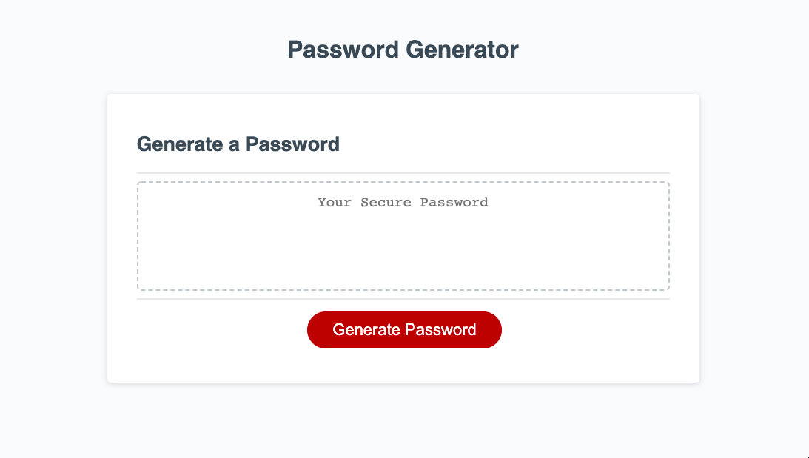
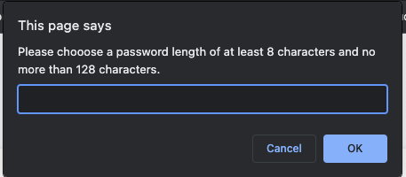
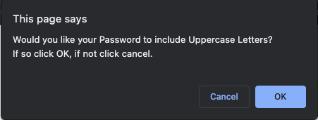
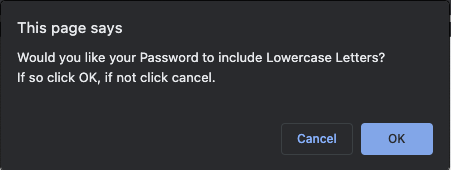
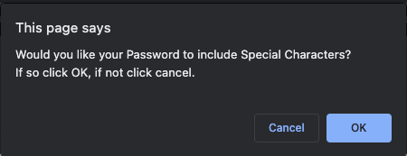
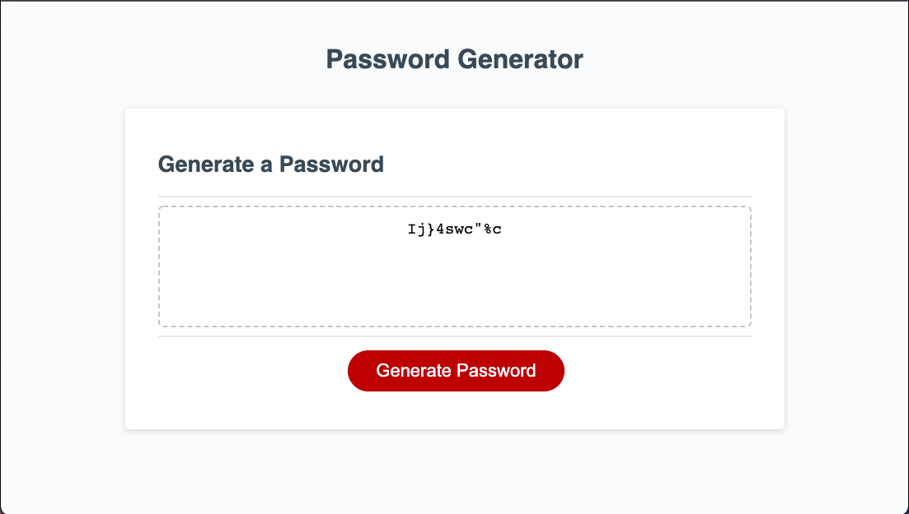

# A Breakdown of Random Password Generator Challenge

## Purpose of Random Password Generator Challenge
This week's challenged allowed us to see how JavaScript can be used to make a webpage more functional. On this particular webpage, JavaScript is used to listen for a click on the "Generate Password" Button. 

Here is an image of the webpage when it is initially loaded: 

Once this click is heard, using JavaScript, the user is taken through a series of prompts to establish a desired password criteria, while making sure at least one password criteria was esentially agreed to. 

Here are images of the prompts one is taken through: 

Then, once the user, chooses a password length between 8-128 and at least one character type (from uppercase, lowercase, numbers, special characters), a random password with the desired criteria is generated and posted to the DOM like so: 

> In this example, the user chose a password of 10 characters with a mix of Uppercase, Lowercase, numerical and special character characters.

All of the functionality of this webpage, was done using JavaScript. Please find in the JavaScript file comments that explain each line of code. 
